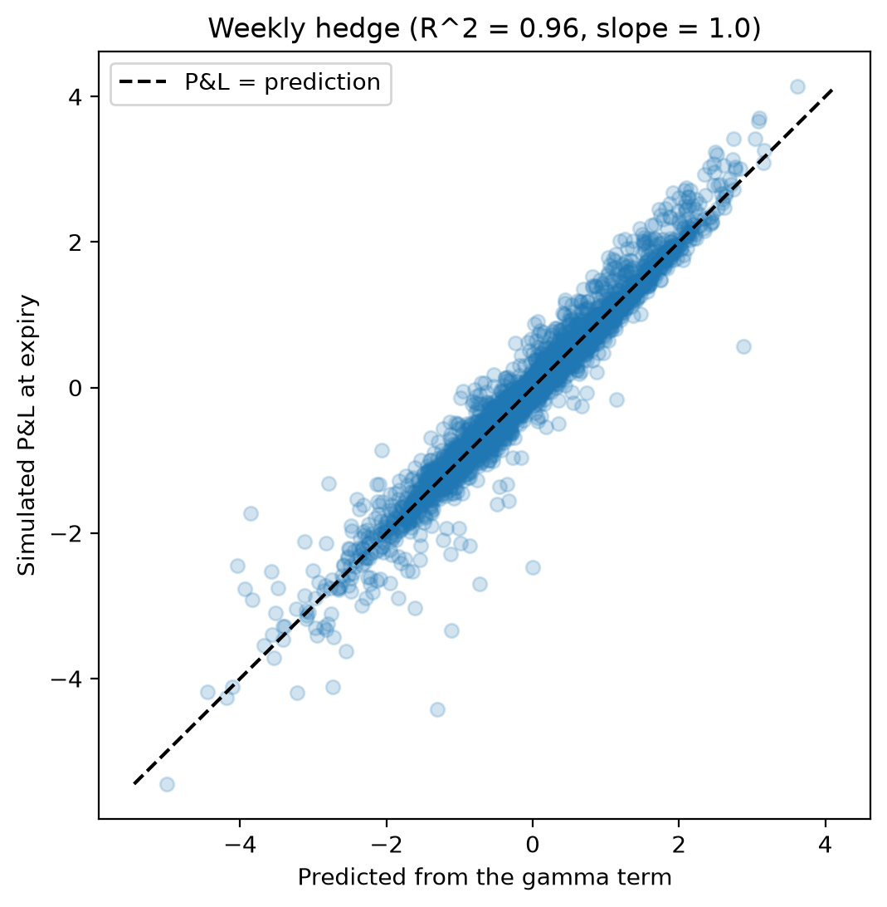
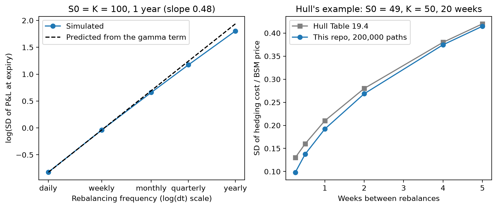

# Discrete Delta Hedging

If a delta hedge can only be rebalanced at discrete intervals, how much risk
is left at expiry, and what determines which paths have the largest errors?

I built a Monte Carlo study in Python to test this. I sell one at-the-money
call, delta hedge it on 50,000 simulated GBM paths, and measure the P&L at
expiry for five rebalancing frequencies, from once a year to daily.

I use Hull's treatment of discrete hedging as the benchmark. Before running
the main simulations, I checked the Black-Scholes implementation and hedge
accounting against his worked examples and Table 19.4.

Result: the hedging error falls in proportion to the square root of the time
between rebalances, and the gamma term from Hull's equations 19.3 and 19.4
accounts for almost all of it.

- Daily hedging cuts the RMSE by 54% vs weekly (0.44 vs 0.96, on an option
  worth 8.92). The fitted slope of log(SD) on log(dt) is 0.48.
- Summing the gamma term along each path predicts the weekly P&L with
  R^2 = 0.96 and a slope of 1.00. The same approximation also predicts the
  size of the error: SD 0.962 predicted against 0.961 simulated.



Each point is one path under the weekly hedge, showing the simulated P&L
against the gamma-term prediction. The first 5,000 paths are plotted; the fit
uses all 50,000.

## Setup

There is no external dataset in this project. I simulate the stock directly
under GBM using the exact lognormal transition (Hull 14.3, 14.7) rather than
an Euler step. This means the stock paths themselves don't introduce
discretisation error, so the remaining expiry error comes from hedging
discretely.

| setting           | value                                                 |
|-------------------|-------------------------------------------------------|
| option            | European call, no dividends, S0 = K = 100, T = 1 year |
| market            | r = 2%, sigma = 20%, mu = r                           |
| paths             | 50,000 daily paths (252 steps), seed 42               |
| hedge frequencies | 1, 4, 12, 52 and 252 times a year, same paths         |

At t = 0 I sell the call for its BSM price, buy delta shares and put the rest
in a cash account earning r. At each hedge date delta is recomputed and the
trade is paid for out of the cash, so the hedge is self-financing (Hull 19.4).
There's no trade at expiry:

```
P&L = cash_T + delta * S_T - max(S_T - K, 0)
```

A continuously rebalanced hedge would make this zero on every path, so all
of the P&L is hedging error.

Experiments:

- `convergence`: the same 50,000 paths hedged at each of the five
  frequencies.
- `gamma_breakdown`: the weekly hedge P&L compared path by path with what
  Hull's Greeks predict.
- `misspecification`: realised volatility from 10% to 30%, hedged daily with
  20%. The option is sold at its fair price, so only the hedge ratio is wrong.

## Results

| rebalances / year | mean | SD   | predicted SD | 5%     | 95%  | shares traded |
|------------------:|-----:|-----:|-------------:|-------:|-----:|--------------:|
| 1                 | 0.02 | 6.07 | 6.93         | -11.45 | 7.33 | 0.58          |
| 4                 | 0.02 | 3.24 | 3.47         | -5.45  | 5.08 | 1.09          |
| 12                | 0.02 | 1.94 | 2.00         | -3.22  | 3.13 | 1.62          |
| 52                | 0.00 | 0.96 | 0.96         | -1.57  | 1.56 | 2.84          |
| 252               | 0.00 | 0.44 | 0.44         | -0.71  | 0.73 | 5.60          |

"Shares traded" is the average cumulative absolute change in the stock
position per option, including the initial hedge. Unrounded numbers are in
`results/summary.csv`.



What stands out in the table:

- The predicted SD is within 0.01 for weekly and daily hedging but too high
  for quarterly and yearly. This is expected, since 19.3 drops terms of higher
  order than dt and a three-month interval is not small.
- The yearly hedge is excluded from the slope fit. With a single hedge date it
  is effectively a static position.
- The expected P&L is zero in this setup, and the Monte Carlo mean is within
  0.03 of zero at every rebalancing frequency.
- Moving from weekly to daily hedging halves the error but doubles the
  trading, which is the trade-off described in Hull 19.10.

### Checking against Hull

Price and Greeks for Hull's running example (S0 = 49, K = 50, r = 5%,
sigma = 20%, 20 weeks) match his Examples 19.1-19.4: 2.4005 vs 2.40, delta
0.5216 vs 0.522, theta -4.3053 vs -4.31, gamma 0.0655 vs 0.066.

I also reproduced his Table 19.4 with mu = 13% and 200,000 paths:

| weeks between rebalances | 5     | 4     | 2     | 1     | 0.5   | 0.25  |
|--------------------------|------:|------:|------:|------:|------:|------:|
| Hull                     | 0.42  | 0.38  | 0.28  | 0.21  | 0.16  | 0.13  |
| this repo                | 0.415 | 0.375 | 0.269 | 0.192 | 0.137 | 0.098 |

The coarse intervals match. At the fine end my results keep falling like
sqrt(dt), while Hull's flatten off. I couldn't work out why, and Hull doesn't
give enough detail to reproduce his simulation exactly, so I've reported the
gap rather than tune anything to close it.

### The gamma term explains it

Between hedge dates the position is delta neutral with gamma -Gamma. Putting
Hull's 19.3 together with 19.4 (with delta = 0), each interval leaves, after
interest,

```
-0.5 * Gamma * (dS^2 - sigma^2 * S^2 * dt)
```

so the hedge loses money when the stock moves more than the volatility in
the option price assumed. To leading order, dS is about sigma S Z sqrt(dt),
so each interval's gamma error has conditional mean zero and standard
deviation proportional to dt. Summing roughly T/dt such increments gives a total
standard deviation proportional to sqrt(dt), which explains the fitted slope
near 0.5. Keeping the constants gives the "predicted SD" column.

My first attempt was simpler: sorting paths by 0.5 Gamma dS^2 with no theta
term. The top fifth carries 38% of the squared error, but the R^2 against
|P&L| is only 0.15. This puzzled me at first. My explanation is that
0.5 Gamma dS^2 is large on any path that moves a lot near the strike, but the
hedge only loses money when the move exceeds what theta has already paid for.
The quintiles are in `results/gamma_quintiles.csv`.

### Hedging with the wrong volatility

| sigma_real              | 10%   | 15%   | 20%  | 25%   | 30%   |
|-------------------------|------:|------:|-----:|------:|------:|
| RMSE                    | 1.02  | 0.72  | 0.44 | 0.99  | 1.92  |
| mean P&L                | 0.00  | 0.00  | 0.00 | 0.00  | 0.00  |
| mean gamma term         | 3.98  | 2.00  | 0.00 | -1.99 | -3.99 |
| mean P&L if sold at 20% | 3.98  | 2.00  | 0.00 | -1.99 | -3.98 |

I initially expected the wrong volatility in delta to shift the average
P&L, so the near-zero mean looked suspicious. But in this experiment the
paths are simulated with mu = r, the option is sold at its fair value, and
the hedge is self-financing. Under the risk-neutral measure (Hull 15.7),
the expected discounted terminal P&L is therefore zero even when the hedge
rule is misspecified. Changing the hedge volatility affects the distribution
of P&L, rather than its expected value.

When realised volatility is 30%, the gamma term contributes about -3.99 on
average, which is almost offset by the extra 3.98 received from selling the
option at the 30% fair value rather than the 20% value. Itô's lemma (Hull
14.6) on the 20% price, together with the BSM equation (15.16), shows the two
have to cancel in expectation. In this setup, hedge-volatility
misspecification mainly changes dispersion, while pricing-volatility
misspecification changes expected P&L.

## Why I set it up this way

- Exact GBM rather than Euler. I wanted the experiment to isolate discrete
  hedging error, not stock-path discretisation error.
- The same simulated paths at each hedge frequency. This is a
  common-random-numbers design, so differences between strategies aren't
  obscured by different Monte Carlo draws.
- mu = r. This keeps the baseline experiment under the risk-neutral measure
  and makes the expected P&L interpretation cleaner. BSM delta doesn't depend
  on mu, and the Hull check uses mu = 13% and still matches.
- Fair option price in the wrong-volatility experiment. I wanted to isolate
  the effect of using the wrong hedge ratio rather than mix hedge error with
  initial mispricing.
- Weekly dates are snapped to the 252-day grid. A weekly frequency doesn't
  divide a 252-day trading year exactly, so the intervals alternate between
  four and five trading days.

## Notes and limitations

- Volatility is constant within each run. In practice volatility moves, so
  the hedge volatility is always somewhat wrong (Hull 19.10).
- GBM has continuous paths, so the experiment excludes jump risk. With jumps,
  there would be residual hedging error that cannot be eliminated simply by
  rebalancing more frequently.
- There are no transaction costs. Daily hedging trades about twice as many
  shares as weekly hedging.
- Only one European call on a non-dividend-paying stock is tested.
- I haven't bounded the terms that 19.3 drops, so I can't say how small dt
  needs to be for the SD formula to hold.
- The gap to Hull's Table 19.4 at the finest intervals is unexplained.

The most natural extension is transaction costs, since the turnover results
already show the cost of rebalancing more frequently. After that, the next
steps would be adding a second option to hedge gamma, and then repeating the
experiment under stochastic volatility.

## Tests

`pytest` runs 23 tests. The most important ones check that:

- price, delta, theta and gamma match Hull Examples 19.1-19.4
- analytic Greeks match finite differences of the price
- the price satisfies Hull's equation 19.4 to 1e-10
- the cash account matches a two-date hedge worked out by hand
- the gamma term predicts the simulated P&L with slope 1, and the SD formula
  is within 5% of the simulated weekly SD

## Running it

```
pip install -r requirements.txt
python -m pytest
python -m scripts.run_pipeline
```

All the fixed settings (contract, seed, number of paths, frequencies) are at
the top of `src/simulation.py`.

```
src/
  simulation.py     settings, GBM paths
  black_scholes.py  price, delta, gamma, theta
  hedging.py        the delta hedge and P&L stats
  experiments.py    Hull checks, convergence, wrong vol, gamma breakdown
scripts/
  run_pipeline.py
tests/
results/
  summary.csv
  gamma_quintiles.csv
  figures/
```

## References

Hull, *Options, Futures, and Other Derivatives*, 11th ed. Chapters 14-15 for
GBM, Itô's lemma and Black-Scholes-Merton; Chapter 19 for dynamic hedging and
the Greeks; Section 21.6 for Monte Carlo.

MIT license.
